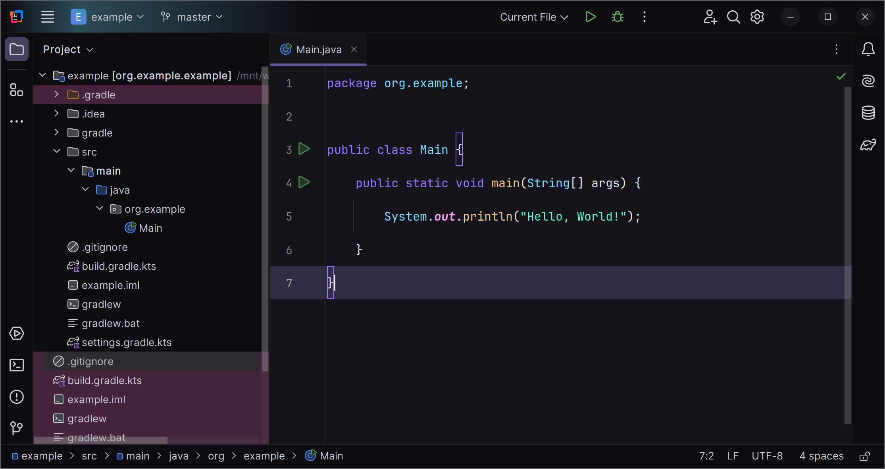
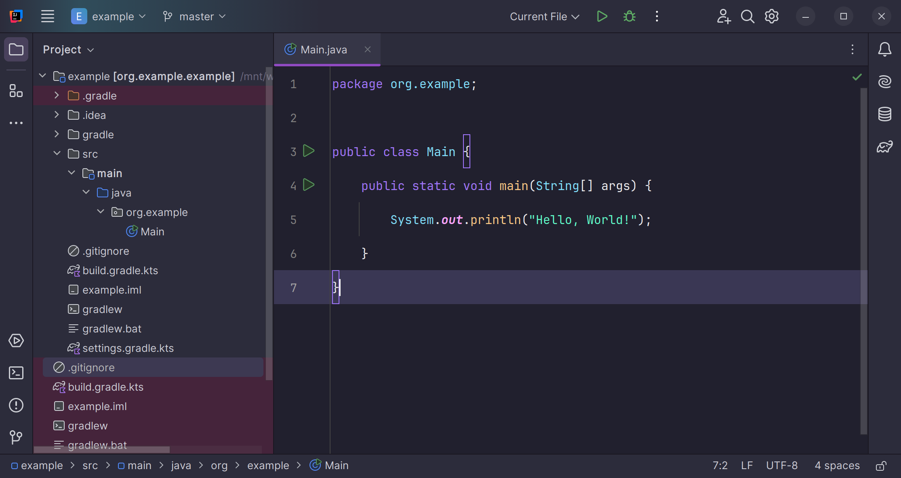

# aura-theme-intellij

A port of the [Aura Theme](https://github.com/daltonmenezes/aura-theme/)
for [JetBrains IDEs](https://www.jetbrains.com/).

## Install

* Go to _Settings (Preferences) | Plugins_, find the theme plugin and install it
* Restart IDE
* Go to _Settings (Preferences) | Appearance & Behavior | Appearance_ and see the _Theme_ dropdown

## Preview

| Aura Dark                    | Aura Soft Dark                    |
|------------------------------|-----------------------------------|
|  |  |

## Credits

[github.com/daltonmenezes/aura-theme](https://github.com/daltonmenezes/aura-theme/)

[github.com/OlyaB/DarkPurpleTheme](https://github.com/OlyaB/DarkPurpleTheme/)

## License

[MIT License](./LICENSE)